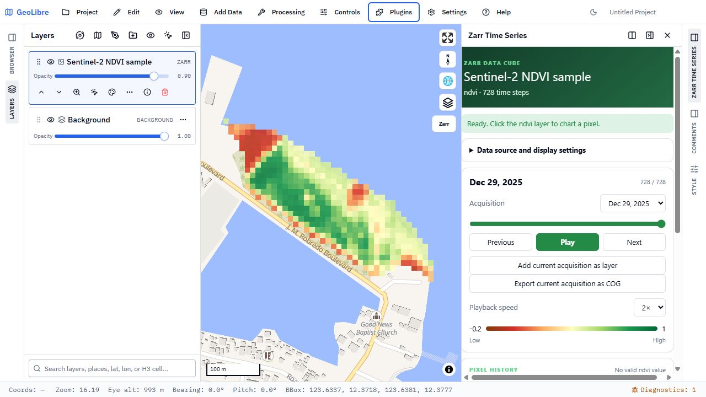
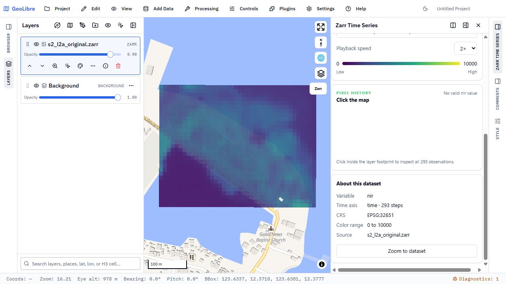

# Zarr Time Series Viewer

A configurable GeoLibre plugin for exploring gridded Zarr time series. The
bundled Sentinel-2 NDVI dataset is now an example preset rather than a fixed
part of the viewer.

The viewer bundles its own Zarr renderer and COG encoder. It only uses the
public plugin APIs available in GeoLibre 3.3.0, so it does not require a
GeoLibre source change. It adds:

- local Zarr folders and remote Zarr v2 and v3 stores;
- configurable variables, time dimensions, regular or explicit coordinates;
- CRS, spatial dimensions, source bounds, and WGS84 map extents;
- variable discovery for local stores and direct acquisition selection;
- adding the current acquisition as a separate map layer for comparison;
- exporting the current acquisition at full resolution as a tiled, overviewed
  Cloud Optimized GeoTIFF, deriving its WGS84 footprint from projected source
  bounds when map bounds are not supplied;
- NDVI, Viridis, Plasma, Blues, Turbo, grayscale, and custom color palettes;
- animated playback and click-to-chart pixel histories; and
- project-state persistence for viewer settings.

## Screenshots

### Bundled NDVI example

### Generic Zarr time series

Open **Data source and display settings** in the panel to configure another
dataset. Use **Choose Zarr folder** for a directory on disk. Consolidated Zarr
v2 metadata is used to prefill the variable, dimensions, time count, date units,
CRS, bounds, color range, and available variables when present. A store nested
inside a selected wrapper folder is detected automatically. Remote stores must
permit browser CORS requests. The sample remains available as the **Bundled NDVI
example** preset.
